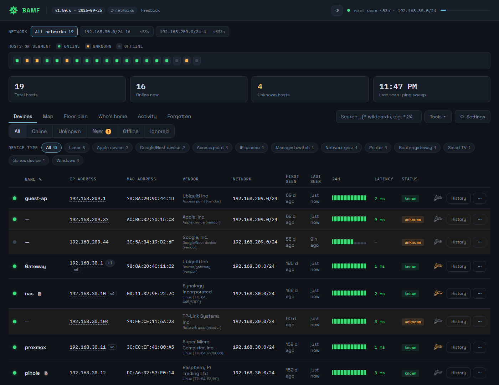

# BAMF — Basic ARP Monitoring Framework

**Know every device on your network, and know the moment a new one appears.**

BAMF watches your LAN at layer 2. It discovers every device via ARP — including
the ones that ignore ping — remembers each MAC it has ever seen, and tells you
when something new turns up or something you care about drops off. It runs as a
Windows Service or a systemd unit, keeps everything in a single SQLite file, and
serves a dashboard on port 8840.

Sample data — a demo database, not a real network.

---

## Why it exists

Most tools in this space are Docker- and Linux-first. BAMF runs **natively on
Windows** as a proper service — no container, no VM, no Linux box — while
working just as well in a Debian LXC on Proxmox. Same codebase, same database
format, same dashboard on both.

It also stays out of your business: **no cloud, no account, no telemetry**. The
dashboard has no external dependencies at all — fonts are served locally, there
are no CDN scripts and no analytics. The only connections BAMF makes are
scanning your own subnets, an optional one-time vendor-list download, an
optional daily update check you have to switch on, and your own webhook.

## What it does

**Discovery**
- ARP-based scanning that finds devices whose firewalls drop ICMP
- Optional raw ARP mode (Npcap/libpcap) with automatic fallback to a sweep
- Multiple subnets at once, scanning each from the right interface
- Hostnames via reverse DNS, then NetBIOS — which names most Windows PCs, NAS
  boxes and printers that have no DNS record
- mDNS listening for the rest — Apple TVs, Chromecasts, Sonos, HomeKit gear and
  printers announce their own names and services, and BAMF reads what they
  volunteer without ever sending a query
- Vendor names from the full IEEE OUI registry

**Knowing what things are**
- Automatic device guesses from vendor and hostname — "Google/Nest device",
  "Printer", "iPhone" — costing nothing and sending nothing
- On-demand **Identify**: one ICMP echo for the TTL plus a probe of eleven
  telling ports, producing guesses that name their own evidence, like
  `Windows (TTL 128, SMB)`
- Custom names and free-text notes, bound to the MAC so they survive IP changes

**Alerting**
- Discord webhooks with rich embeds — amber for a new unknown device, red when
  a watched device goes offline, green when it returns with how long it was down
- Self-hosted push too: ntfy and Gotify, each in the format it expects, plus a
  generic JSON body for anything else
- Set it up by pasting a URL into the dashboard; no config file, no restart
- Star only the devices you actually care about
- Auto-ignore phones using MAC randomisation, so they don't cry wolf

**Investigating**
- Per-host and network-wide port scanning, always on demand, never automatic
- Wildcard targets: `*.245` checks that address on every network,
  `192.168.2.*` walks a subnet
- Per-device links, so a device's IP opens its actual admin UI —
  `8006` for Proxmox, `https://{ip}:8443`, whatever it happens to be
- Session history per device, a 24-hour sparkline, and a network-wide activity feed
- Address history per device — every IP it has held and when it moved, for
  chasing DHCP squabbles and pool exhaustion
- Devices on several addresses at once, like a router on every network, keep
  them all: a **+N** chip beside the IP lists them, and the device shows on each
  network it's on
- A map of each network, with the gateway and BAMF's own machine marked, and
  honest about its limits: it shows who is present, and draws cabling only where
  you've recorded your switches and which port each device is on
- A **whole network** view that draws every network as one diagram, by the
  cabling you recorded, with each device tagged by its network's colour
- A **floor plan** per floor, with each device pinned where it actually sits,
  coloured by whether it's online

**Watching for trouble**
- An ARP watch for IP conflicts and anything claiming to be your gateway
- A hygiene card for risky open ports, plain-HTTP settings pages, UPnP and expiring HTTPS certificates
- An optional daily check, off by default, of whether your home's public address
  has been seen scanning the internet
- What changed this week, when each device is usually home, and IPv6 addresses beside the IPv4 ones

**Operating it**
- Version and build date in the header, the log and the API, so "which build is
  this?" is always answerable
- Runs as a Windows service, a systemd service, a Docker container or a Home Assistant add-on
- One script installs *and* updates, preserving your config and database
- Scheduled nightly backups keeping 30 snapshots, safe to sync to cloud storage
- Optional password (HTTP Basic), with a second view-only password for a wall
  display or the rest of the house, and optional HTTPS
- 39 themes (and a couple more, if you know how to ask, or drop your own in), grouped into colours, animated and holidays, a mobile card layout, and a
  comic-book splat when you switch them

**For scripts and AI agents**
- `GET /api/hosts.txt` returns the whole device table as plain text — no JSON,
  no markup, sorted so two fetches diff cleanly
- Every route that changes anything is a POST or DELETE, so a consumer limited
  to that one GET is inherently read-only

### See how it's laid out

![The Map's whole-network view: two networks in one diagram, each device tagged with its network's colour. The home router is at the top with a device on its own port. A 16-port switch on the router's port 1 has its devices in port order with each port's location, including BAMF itself on port 3 and a Proxmox host whose virtual switch holds a VM from the other network. The Hallway access point broadcasts a Home and a Guest SSID, each with its devices joined by lightning bolts. An office switch is chained further along, and the second network's gateway sits beside the first network's box of devices](docs/map.png)

The **Map** draws each network as a diagram: your router at the top with its own
ports, your switches and access points under it, each one's devices in port
order with where the cable goes (`6 · Living Room`), and an icon for each kind
of device. **Whole network** puts every network in one diagram, drawn by the
cabling, with each device tagged in its network's colour. Cabling isn't
something ARP can see, so BAMF doesn't guess it. Record your switches under
**Settings → Switches**, or just drag a device onto a switch on the map, and
the map draws it as a cable, or as a lightning bolt for a device on a
wireless SSID. Anything you haven't recorded, like the two devices in the box
above, waits in an "On this network" box. Drag anything to arrange it
the way your house is laid out; it's saved, so it looks the same on every
screen. It works with any switch, including unmanaged ones.

### See where things are

The **Floor plan** tab puts each device on a picture of your home, so an
offline camera is a grey pin by the back door rather than an address you have
to place. Upload a plan per floor — a photo of a sketch does — then pick a
device and click where it goes. Pins follow whether each device is online, and
clicking one opens it.

No plan of your home? **✎ Draw a plan** gives you walls that straighten
themselves and snap together, measured against a scale you set, with doors,
windows and room names. Type an exact length for a wall and it takes it.

Switch on **Watch the internet connection** and BAMF pings your router and one
address out on the internet every minute, so it can tell you when the line
dropped, for how long, and whether the fault was inside the house or out. It's
off until you ask for it, because that outside ping is the one thing BAMF sends
on a timer.

### Tune it without touching the server

![The Settings tab: scan interval, probe concurrency, history retention, an on/off switch and scan interval per network, the recorded switches, access point and SSIDs with layout export and import, the instant toggles for active ARP, randomised MACs, the traffic monitor, latency measuring, the ARP watch, IPv6 neighbours, the certificate watch, the GreyNoise check of your public address, the internet watch with the address it pings and how often, Holiday Spirit, Night mode with its hours and theme, and update checks, then alert rules including a scheduled wake, quiet hours and the daily port watch, and last the notification settings: the webhook with a button for setting alerts up on your phone without Discord, and the scheduled report, which can be never, daily, weekly or monthly](docs/settings.png)

Scan cadence, probe concurrency and history retention are editable from the
dashboard and applied on the next scan — no restart, no editing a file over SSH.
Each network can run on **its own interval**, so a busy server VLAN and a mostly
idle guest network no longer have to share one. A device is only judged offline
by a scan that actually covered its network, so differing intervals don't
produce false down-alerts. The header counts down to whichever network is due
next and names it; each network tab shows its own figure, and the Settings
table reads `every 90s · next in 62s` per network.

Every setting lives on this one tab — the instant toggles for active ARP,
randomised-MAC filtering and update checks, and the notification webhook, all
sit below the scan settings rather than scattered across the header and a menu.

Which networks BAMF may touch stays in `appsettings.json`, shown read-only here
on purpose: it is the boundary the wildcard port-scan guard relies on.

## Install

Download a release — **no .NET SDK needed, the runtime is bundled**:

| | |
|---|---|
| **Windows** | [`BAMF-*-win-x64.zip`](https://github.com/rhc52980/BAMF_Network_Monitor/releases/latest) |
| **Linux** | [`BAMF-*-linux-x64.tar.gz`](https://github.com/rhc52980/BAMF_Network_Monitor/releases/latest) |

Extract, run the binary, open `http://localhost:8840`, and set your subnets in
`appsettings.json`.

Prefer the installer to manage the service, updates and backups for you? Build
from source instead — `windows\Install-BAMF.bat` or `linux/install.sh`, both of
which install *and* update. That route needs the .NET 8 SDK on the machine
(Linux fetches it for you).

**Full documentation:** [`BAMF/README.md`](BAMF/README.md) ·
**Proxmox / LXC guide:** [`BAMF/linux/README-PROXMOX.md`](BAMF/linux/README-PROXMOX.md)

## What it can't do

ARP is layer 2, so BAMF only sees segments it has an interface on. Devices on
another VLAN are invisible unless the machine has a leg on that network too —
one NIC per subnet you want watched.

It's also a monitor, not a security product. Device identification is a
heuristic, not nmap: no stack fingerprinting, no version detection. It reports
what the evidence suggests and names the evidence, so you can judge it.

## Requirements

- **Windows** Server 2022, or Windows 10/11 · **Linux** Debian 12 / Ubuntu 22.04+
- Optional, for raw ARP scanning: [Npcap](https://npcap.com) on Windows,
  `libpcap` on Linux — without it BAMF falls back to a sweep
- A network interface on each subnet you want to watch

## Licence

MIT — see [LICENSE](LICENSE).
