# BAMF themes

BAMF comes with 46 themes. **Dark**, **Light** and **High Contrast** are built
in. The other 43 are here, one folder each, and every one of them comes with
BAMF: a new install has them all.

You pick which ones your theme menu offers. Open **Settings → Appearance →
Themes** to see them all with their pictures, then **Remove** the ones you
don't want and **Add** them back whenever you like. A removed theme stays
removed through updates, and a theme that's new in an update turns up on its
own.

## Adding a theme someone shared

A theme is a folder with a `theme.json` in it, and it travels as a `.zip`.
Either:

- open **Settings → Appearance → Themes** and click **Add a theme from a
  .zip…**; or
- drop the `.zip`, or the folder itself, into BAMF's `themes` folder and reload
  the dashboard.

A zip can hold one theme or a whole pack of them, each in its own folder. Only
a theme's own files are taken out of it (`theme.json`, `theme.css`, `theme.js`
and a preview picture). If one can't be added, Settings says why.

Where the `themes` folder is:

| Install | Folder |
|---|---|
| Windows | `C:\BAMF\themes` |
| Linux | `/opt/bamf/themes` |
| Docker and the Home Assistant add-on | `/data/themes`, on the data volume |

Settings → Appearance → Themes shows the exact path on yours. It can be moved
with `Bamf:ThemesPath`.

A theme's script runs in the dashboard, so only add themes from people you
trust, the same as any other program.

## The themes

### Colours

Colour schemes: nothing moves, or next to nothing.

<table>
<tr>
<td width="50%" valign="top">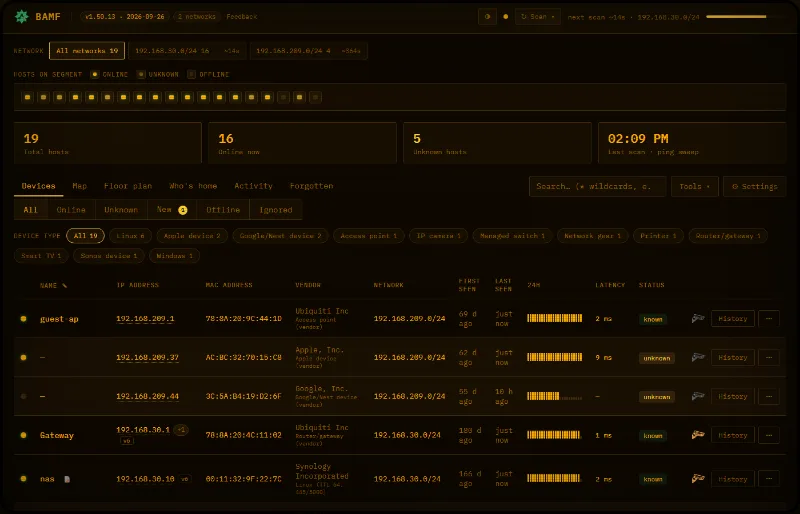<br><b>Amber CRT</b> <sub><code>amber</code></sub><br>An old amber monitor: warm phosphor on black.</td>
<td width="50%" valign="top">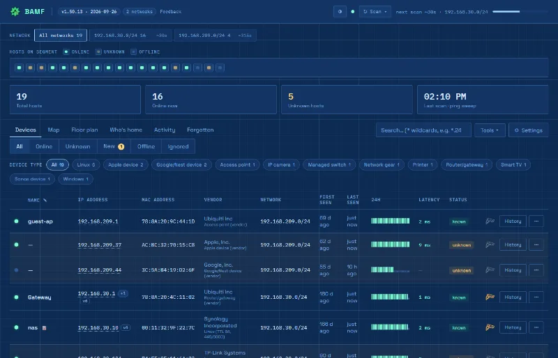<br><b>Blueprint</b> <sub><code>blueprint</code></sub><br>The dashboard drawn on blueprint grid paper.</td>
</tr>
<tr>
<td width="50%" valign="top">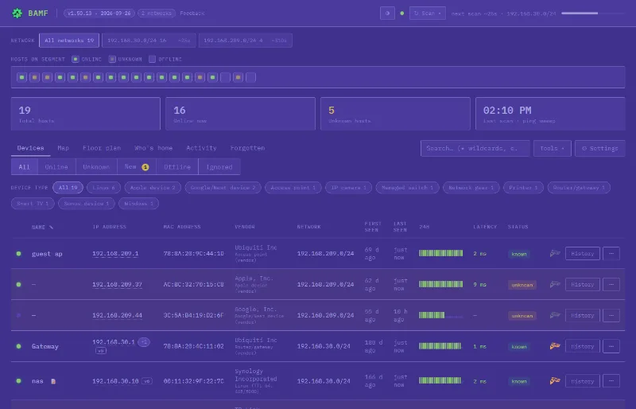<br><b>Commodore 64</b> <sub><code>c64</code></sub><br>The Commodore 64's blue-on-blue start-up screen.</td>
<td width="50%" valign="top">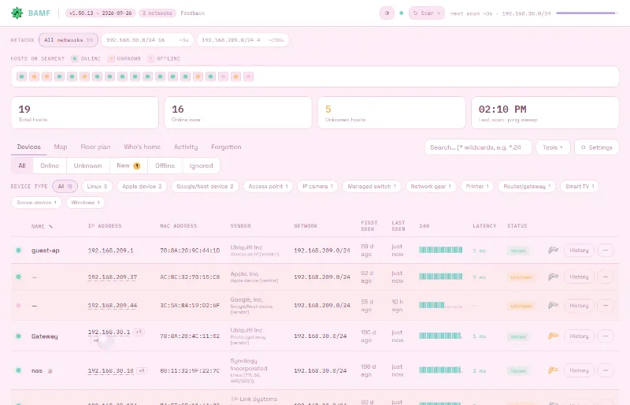<br><b>Cotton Candy</b> <sub><code>cottoncandy</code></sub><br>Pastel pink and mint, with a few bubbles floating up.</td>
</tr>
<tr>
<td width="50%" valign="top">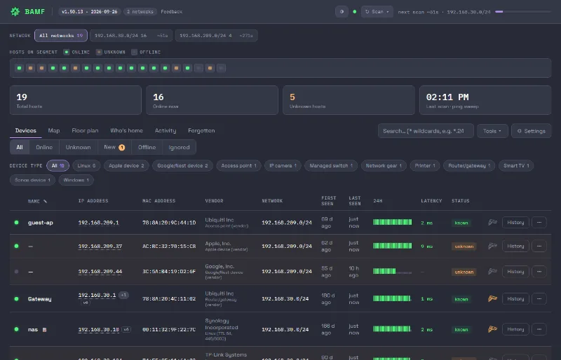<br><b>Dracula</b> <sub><code>dracula</code></sub><br>The Dracula palette: purple, pink and green on charcoal.</td>
<td width="50%" valign="top">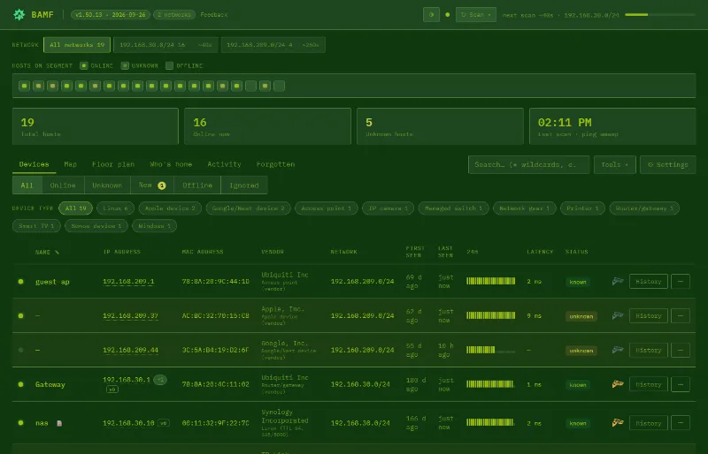<br><b>Game Boy</b> <sub><code>gameboy</code></sub><br>Four shades of pea green, like the original Game Boy.</td>
</tr>
<tr>
<td width="50%" valign="top">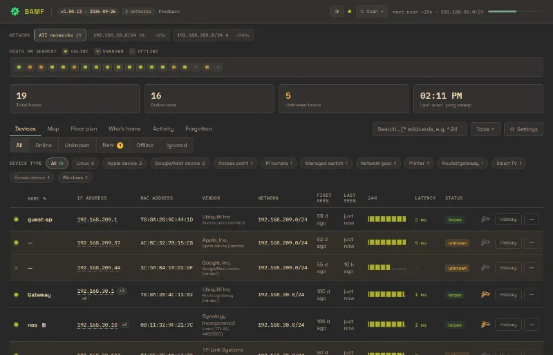<br><b>Gruvbox</b> <sub><code>gruvbox</code></sub><br>Gruvbox's retro, earthy yellows and greens.</td>
<td width="50%" valign="top">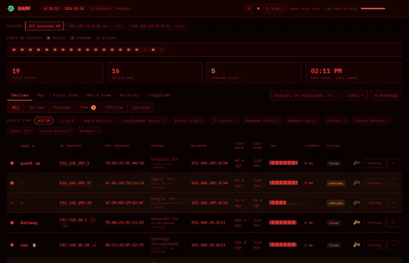<br><b>Hacker Red</b> <sub><code>hackerred</code></sub><br>Red on black, with the header glitching now and then.</td>
</tr>
<tr>
<td width="50%" valign="top">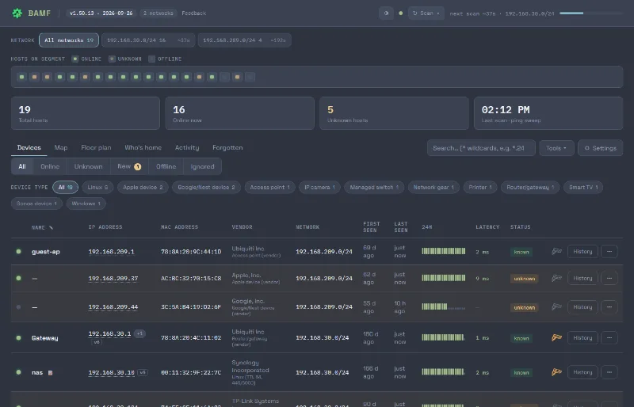<br><b>Nord</b> <sub><code>nord</code></sub><br>Nord's cool, quiet arctic blues.</td>
<td width="50%" valign="top">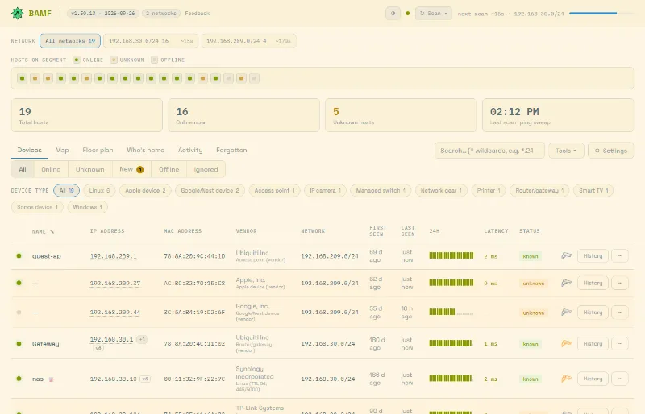<br><b>Solar Light</b> <sub><code>solar-light</code></sub><br>Solarized light: the same palette on warm cream paper.</td>
</tr>
<tr>
<td width="50%" valign="top">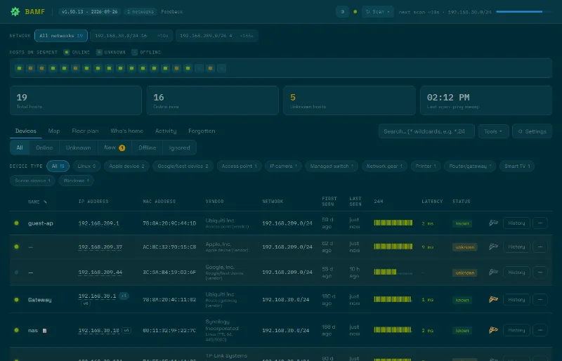<br><b>Solarized</b> <sub><code>solarized</code></sub><br>Solarized dark: calm blues and greens on deep teal.</td>
<td width="50%" valign="top">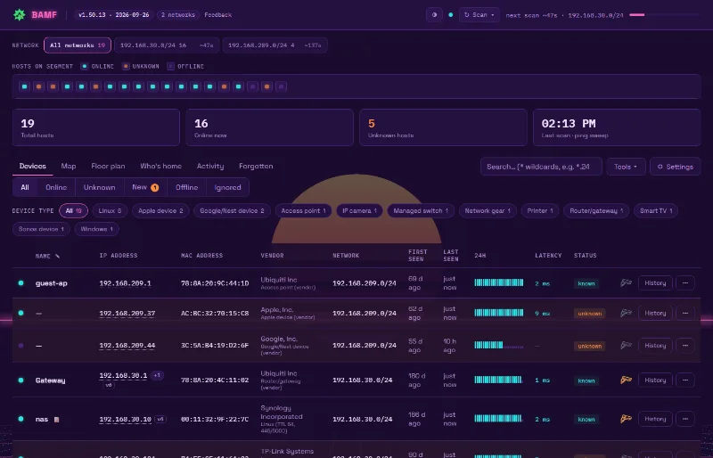<br><b>Synthwave</b> <sub><code>synthwave</code></sub><br>Neon pink and cyan, with a grid rolling toward a striped sun.</td>
</tr>
</table>

### Animated

Something going on behind the dashboard. Reduced motion settles them all.

<table>
<tr>
<td width="50%" valign="top">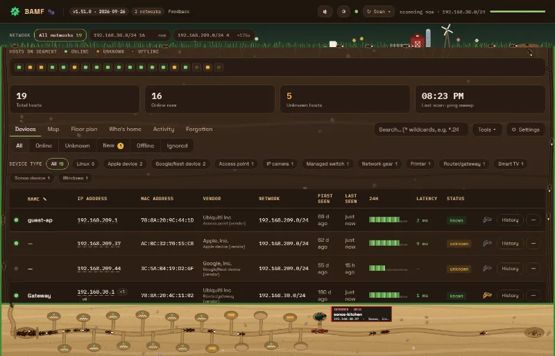<br><b>Ant Farm</b> <sub><code>antfarm</code></sub><br>A glass ant farm with a chamber for every device. An unknown new device is a beetle: the colony swarms it and seals it in.</td>
<td width="50%" valign="top">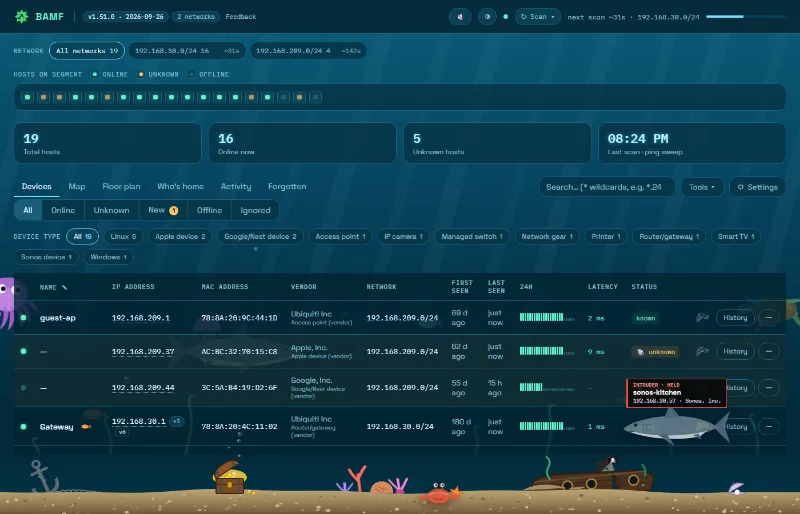<br><b>Aquarium</b> <sub><code>aquarium</code></sub><br>Fish, bubbles, weed and a crab behind the glass. An unknown new device is a shark: the fish scatter while it prowls.</td>
</tr>
<tr>
<td width="50%" valign="top">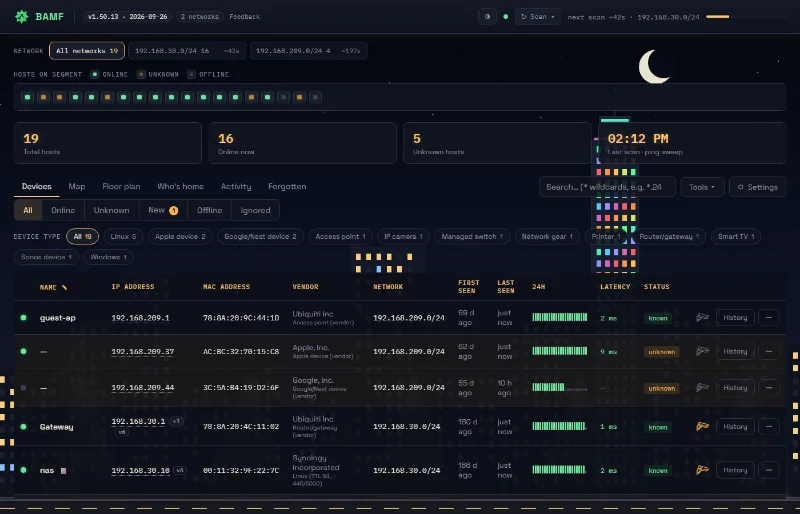<br><b>City Lights</b> <sub><code>nightstreet</code></sub><br>A city after dark: street lamps, lit windows, and traffic going by. An unknown new device is a car running dark, chased down and pulled over.</td>
<td width="50%" valign="top">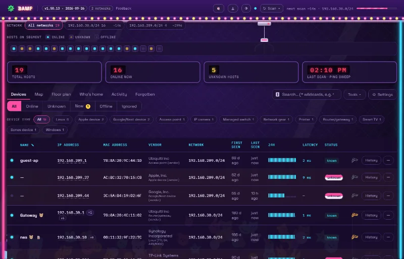<br><b>Claw Machine (with Claw Machine Dusk)</b> <sub><code>claw</code></sub><br>A prize cabinet with marquee bulbs, and a claw that sometimes wins a device. An unknown new device is a TILT, and a mystery prize nobody put in.</td>
</tr>
<tr>
<td width="50%" valign="top">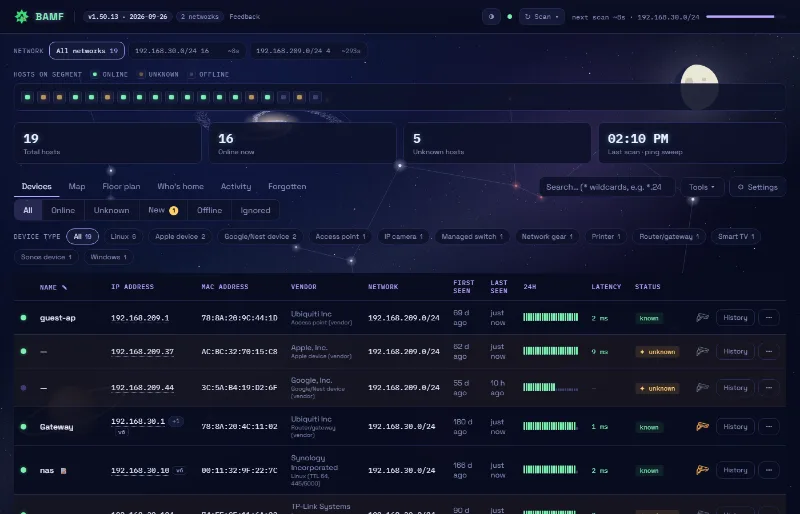<br><b>Constellation</b> <sub><code>constellation</code></sub><br>Your network as stars, under a moon that shows how much of it is up. An unknown new device is a rogue comet, and the stars close ranks.</td>
<td width="50%" valign="top">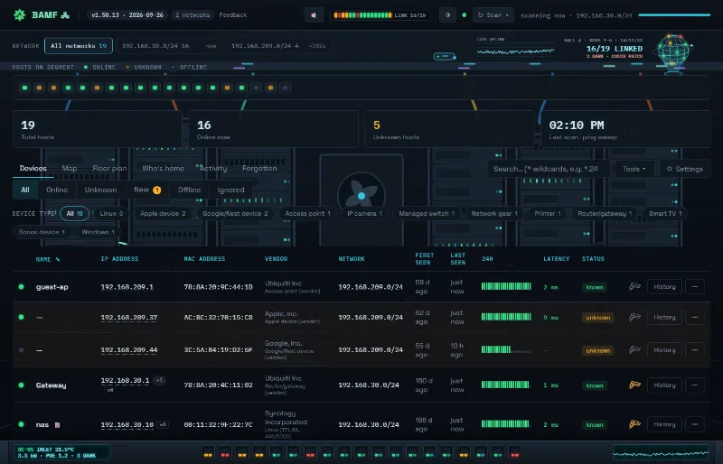<br><b>Data Centre</b> <sub><code>datacentre</code></sub><br>The room your network would live in if it had one: racks, blinking lights and a patch panel. An unknown new device puts the room in lockdown and its port in quarantine.</td>
</tr>
<tr>
<td width="50%" valign="top">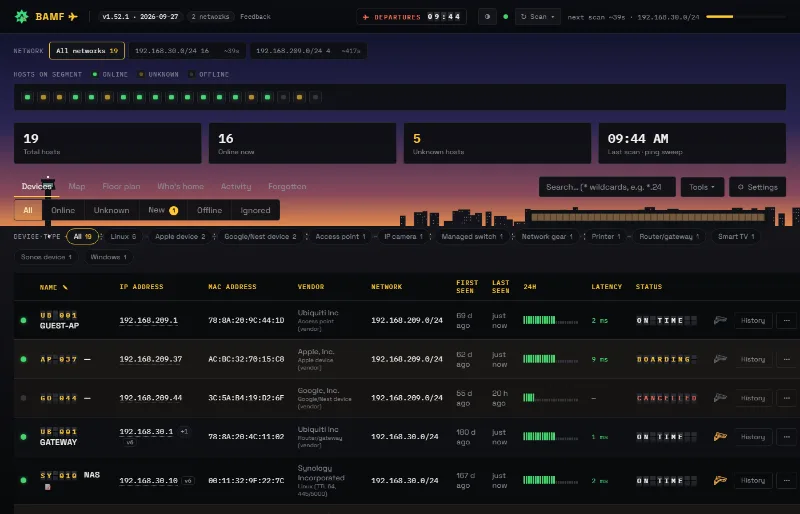<br><b>Departures</b> <sub><code>departures</code></sub><br>An airport departures board, letters flipping over. An unknown new device is an unscheduled arrival: SECURITY ALERT, and every flight holds.</td>
<td width="50%" valign="top">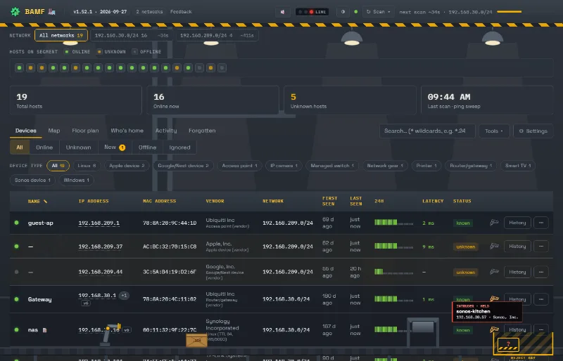<br><b>Factory (with Factory Night Shift)</b> <sub><code>factory</code></sub><br>A shop floor with a belt running, a press, and an arm that picks off the line. An unknown new device is a part not on the manifest: the line stops and it goes to the reject bay.</td>
</tr>
<tr>
<td width="50%" valign="top">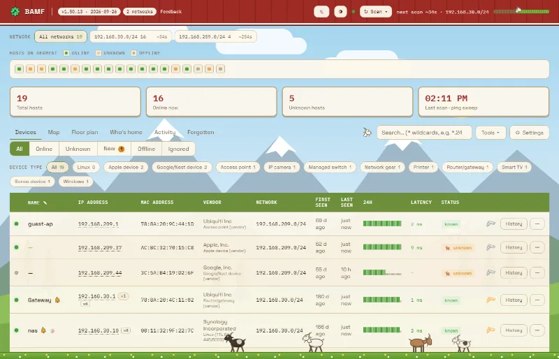<br><b>Goat (with Goat Night)</b> <sub><code>goat</code></sub><br>An alpine pasture with a barn and a herd of goats with opinions. An unknown new device is a wolf, and the ram sees it off.</td>
<td width="50%" valign="top">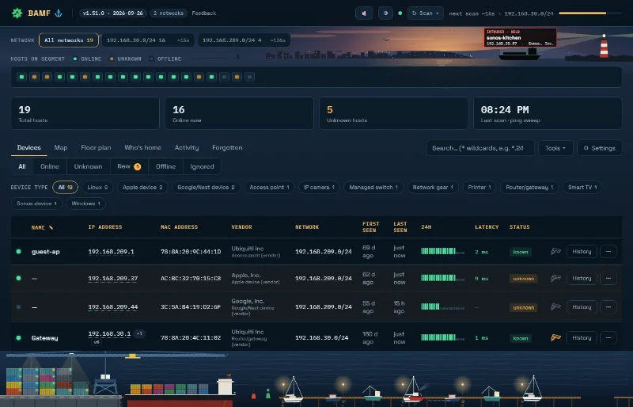<br><b>Harbour</b> <sub><code>harbour</code></sub><br>A quay at dusk with a container for every device. An unknown new device is a ship with no lights, held off the breakwater in the lighthouse's beam.</td>
</tr>
<tr>
<td width="50%" valign="top">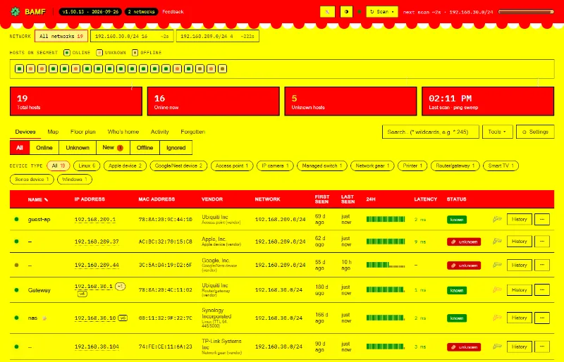<br><b>Hotdog Stand</b> <sub><code>hotdog</code></sub><br>Windows 3.1's loudest colour scheme, with a hot dog stand to go with it. An unknown new device is a seagull that makes off with a hot dog.</td>
<td width="50%" valign="top">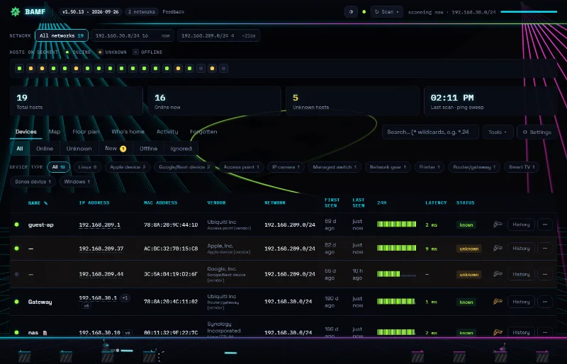<br><b>Laser Show</b> <sub><code>laser</code></sub><br>A laser show in a dark room, beams through the haze. An unknown new device is a rogue droid, held in every beam and both squads' sights.</td>
</tr>
<tr>
<td width="50%" valign="top">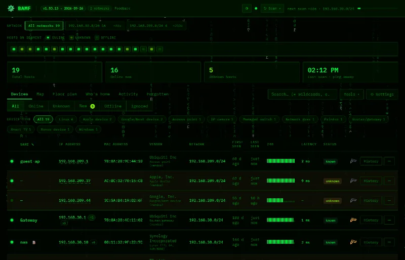<br><b>Matrix</b> <sub><code>matrix</code></sub><br>Digital rain with your devices' names falling in it, numbers that decode, and a white rabbit. An unknown new device turns the rain red and brings an Agent.</td>
<td width="50%" valign="top">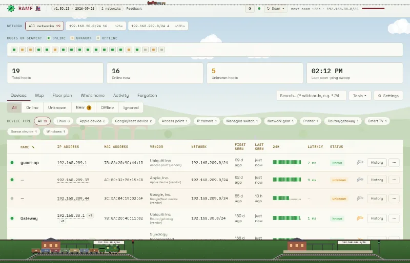<br><b>Model Railway</b> <sub><code>railway</code></sub><br>A model train set round the edges of the page. An unknown new device is a rogue engine: signals to red, brakes on, shunted into the siding.</td>
</tr>
<tr>
<td width="50%" valign="top">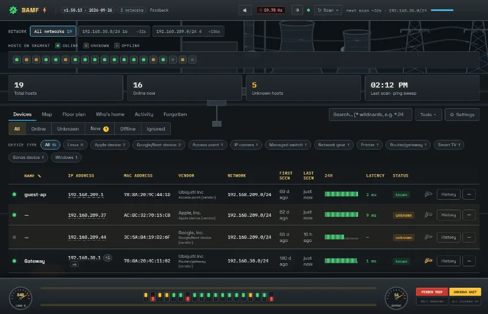<br><b>Power Plant</b> <sub><code>powerplant</code></sub><br>A turbine hall with cooling towers, and a control desk along the bottom. An unknown new device is an unauthorised load: a zone trips and its breaker is locked out.</td>
<td width="50%" valign="top">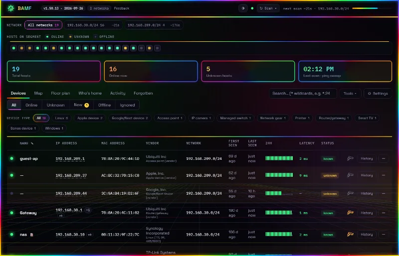<br><b>RGB</b> <sub><code>rgb</code></sub><br>The dashboard as a gaming rig with every light on. An unknown new device is a strange stick plugged into the rig, and the frame strobes red.</td>
</tr>
<tr>
<td width="50%" valign="top">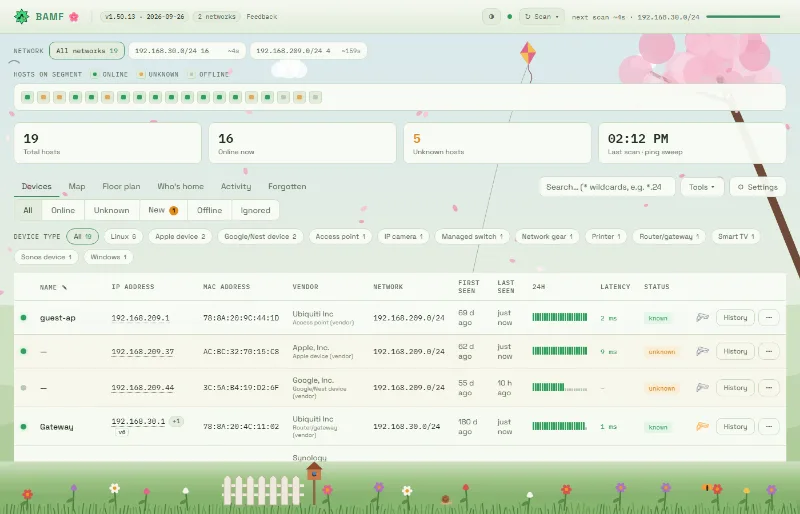<br><b>Spring</b> <sub><code>spring</code></sub><br>Blossom coming down over a soft morning. An unknown new device is a fox, and the hens scatter.</td>
<td width="50%" valign="top">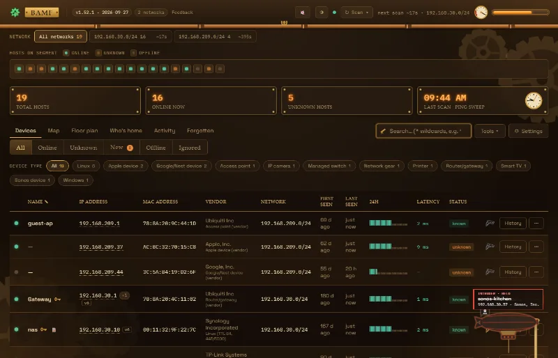<br><b>Steampunk</b> <sub><code>steampunk</code></sub><br>Walnut and brass, gears turning, an airship, and nixie-tube numbers. An unknown new device is a pirate airship, hauled down and moored at the mast.</td>
</tr>
<tr>
<td width="50%" valign="top">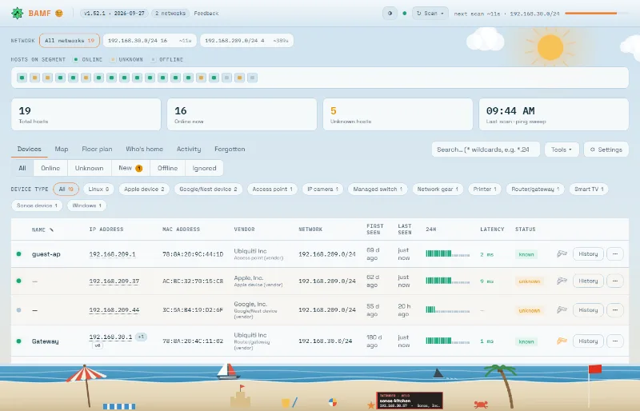<br><b>Summer</b> <sub><code>summer</code></sub><br>Sun, clouds and the beach along the bottom. An unknown new device is a shark offshore, and the lifeguard runs up the red flag.</td>
<td width="50%" valign="top">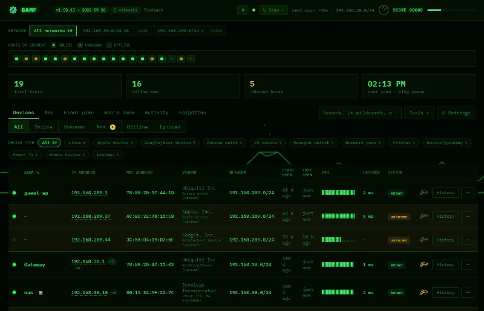<br><b>Terminal</b> <sub><code>terminal</code></sub><br>Battlezone in green vectors behind the page: wireframe tanks prowl, one for each unknown device, and a scan fires a shell. An unknown new device is traced and quarantined.</td>
</tr>
<tr>
<td width="50%" valign="top">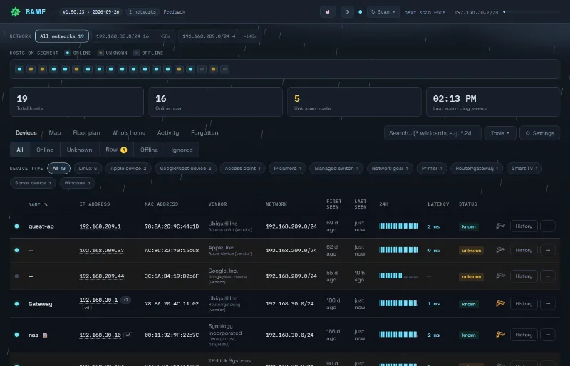<br><b>Thunderstorm</b> <sub><code>storm</code></sub><br>Rain behind the page, soft lightning, and a spark along the Map's cables. An unknown new device is a stranger out in the storm, struck by lightning.</td>
<td width="50%" valign="top">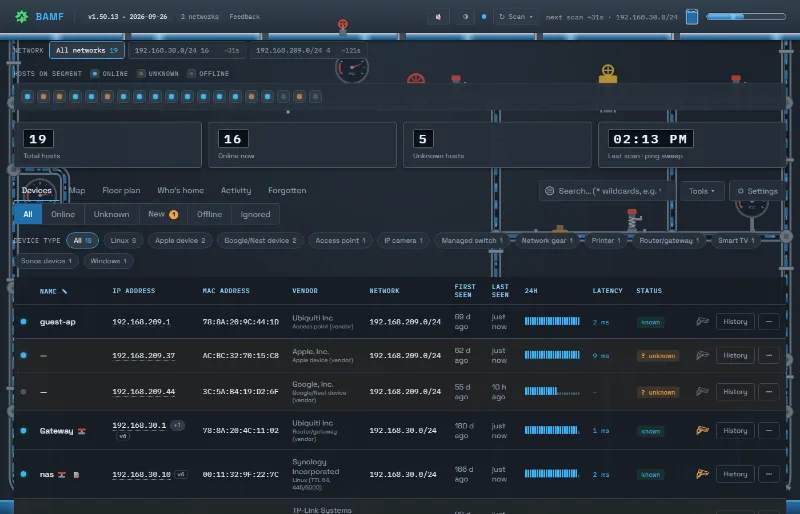<br><b>Waterworks</b> <sub><code>waterworks</code></sub><br>Pipes, valves and gauges, with water pulsing to every device. An unknown new device is a leak: the pressure alarm, then its valve locked out.</td>
</tr>
<tr>
<td width="50%" valign="top">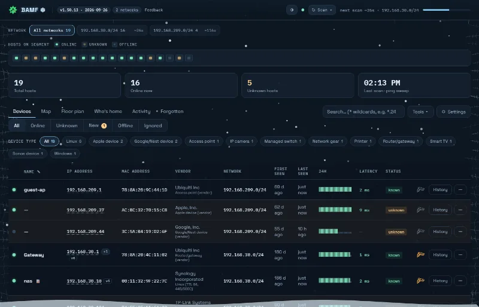<br><b>Winter</b> <sub><code>winter</code></sub><br>Snow, and frost creeping in at the edges. An unknown new device is a yeti, stomping into the drift.</td>
<td width="50%" valign="top">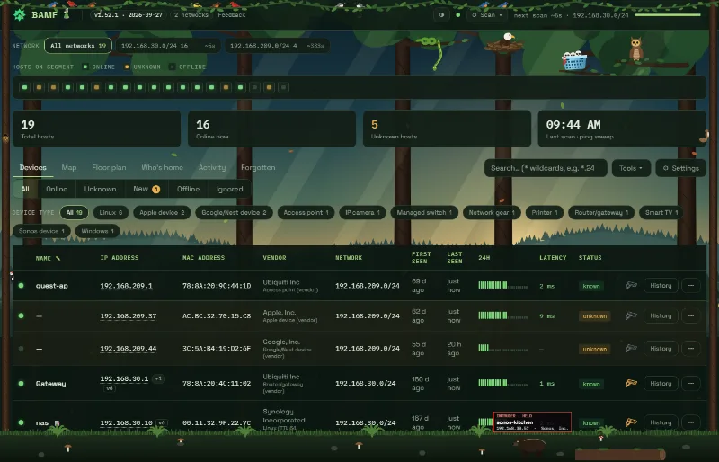<br><b>Woodlands</b> <sub><code>woodlands</code></sub><br>A forest late in the afternoon, with its wildlife. An unknown new device is a bear in the clearing, and the owl won't take its eyes off it.</td>
</tr>
</table>

### Holidays

Seasonal. Holiday Spirit puts these on by date.

<table>
<tr>
<td width="50%" valign="top">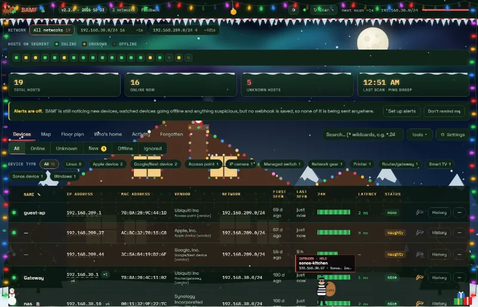<br><b>Christmas</b> <sub><code>christmas</code></sub><br>Twinkling lights, swinging ornaments, a little snow, and Santa hats on the Map. An unknown new device is a burglar on the naughty list. Hidden in the menu until it's unlocked.</td>
<td width="50%" valign="top">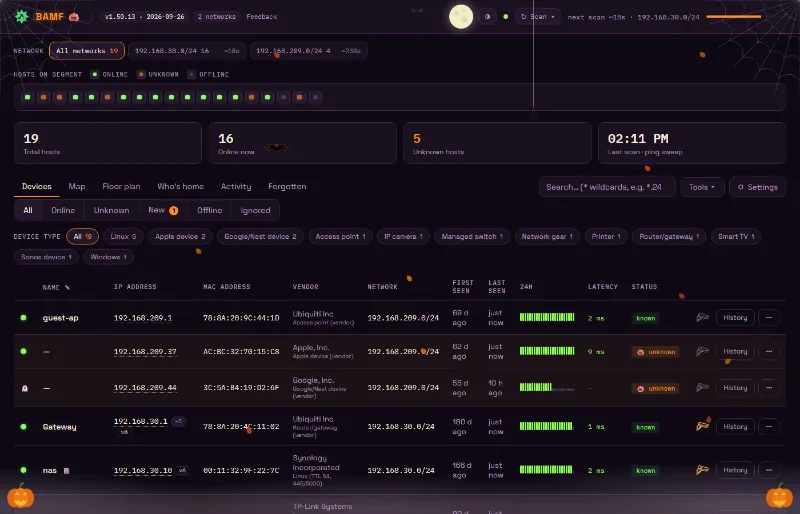<br><b>Halloween</b> <sub><code>halloween</code></sub><br>Cobwebs, a spider, jack-o'-lanterns, and now and then a bat or a ghost. An unknown new device is a werewolf under a blood moon, held at the graveyard gate. Hidden in the menu until it's unlocked.</td>
</tr>
<tr>
<td width="50%" valign="top">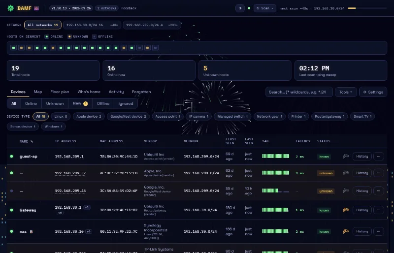<br><b>New Year</b> <sub><code>newyear</code></sub><br>Fireworks over a midnight skyline. An unknown new device is a gatecrasher, held at the velvet rope.</td>
<td width="50%" valign="top">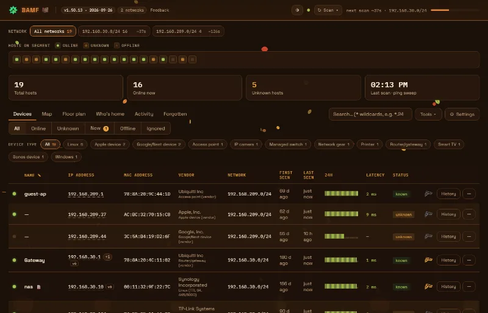<br><b>Thanksgiving</b> <sub><code>thanksgiving</code></sub><br>Leaves coming down over a harvest table, and a turkey. An unknown new device is a raccoon at the pie.</td>
</tr>
</table>

## Making a theme

Copy the folder of a theme that's close to what you want, give the copy a new
name, and change it. The folder's name is the theme's id: lower-case letters,
digits and dashes, up to 40, and not one a built-in theme has.

```
themes/
  my-theme/
    theme.json     its name, colours and description
    theme.css      optional: its colours and styles
    theme.js       optional: its animations and reactions
    preview.webp   optional: the picture in Settings (a .png or .jpg works too)
```

### theme.json

```json
{
  "name": "My Theme",
  "swatch": ["#101820", "#f2aa4c", "#ffffff"],
  "category": "colours",
  "description": "What it looks like, in a sentence.",
  "author": "You"
}
```

`category` is `colours`, `animated` or `holiday`, and says where the theme
menu lists it; leave it out and it goes under **More**. `swatch` is the three
colours the menu shows beside the name. A folder can hold a second theme that
shares its files, the way Goat Night lives in the Goat folder:

```json
"variants": [{ "id": "my-theme-night", "name": "My Theme Night", "swatch": ["#000", "#f2aa4c", "#fff"] }]
```

### theme.css

BAMF loads it only while the theme is on. Set the dashboard's colour variables,
scoped to the theme's id, and style anything else the same way:

```css
[data-theme="my-theme"] {
  --bg:#101820; --panel:#18222e; --panel-2:#1f2b3a; --line:#2c3a4d;
  --text:#e8eef5; --text-dim:#8a9bb0; --led-on:#4cd98a; --led-warn:#f2aa4c;
  --led-off:#3a4758; --danger:#ff6b6b; --focus:#f2aa4c; --radius:8px;
}
```

### theme.js

It registers the theme and gets a small context to work with. Everything it
starts through the context stops when someone picks another theme:

```js
BAMF.registerTheme("my-theme", ctx => {
  // ctx.root: a layer over the page that never takes a click
  // ctx.background(el): put an element behind the page
  // ctx.later(fn, ms), ctx.every(fn, ms), ctx.onStop(fn)
  // ctx.calm: true when reduced motion is on, so hold still
  // ctx.switched: true if the user just switched to this theme
  // ctx.hosts(), ctx.view(), ctx.headerBottom(), ctx.wentOffline()
  // helpers: ctx.svg(tag, attrs), ctx.rnd(a, b), ctx.pick(list), ctx.esc(text), ctx.nameOrIp(host)
  ctx.on("newDevice", host => { /* a new device appeared */ });
  ctx.on("scanDone", () => { /* a scan finished */ });
  ctx.on("rendered", () => { /* the dashboard redrew */ });
  ctx.on("netChange", (offIds, backIds) => { /* devices went offline or came back */ });
  ctx.on("decorateNode", (g, node) => { /* add SVG to a Map node as it's drawn */ });
  ctx.on("intruder", host => { /* a new device nobody has marked known: raise the alarm */ });
});
```

### Intruders

A new device that hasn't been marked known is an intruder, and a theme can make
a scene of it, the way the animated and holiday themes here do.
`intruder` fires when one turns up; after that the scene holds it, in view,
until it's marked known. What to hold is `ctx.intruders()`: the devices on the
New tab, the same on every dashboard. `ctx.intruderWatch()` gives a function
that says, each time it's called, what's held now, what's been `added` and
what's been `cleared` since it last looked, so the scene knows when to stand
down. Hang `ctx.intruderTag(g, x, y, host, { state })` on it on a canvas, or
`ctx.intruderTagEl(host, state)` as an element, so every theme's tag reads the
same; `state` is `"alarm"`, `"held"` or `"cleared"`. **Show me an intruder**, in
Settings → Appearance, plays your scene on a test device (its host has
`test: true`) that clears by itself after 25 seconds.

Wrap your script in `(() => { ... })();` so its names don't meet another
theme's. The themes in this folder ship with BAMF and use some of the
dashboard's own helpers besides the context, so they're kept in step with the
BAMF they come with; a theme of your own should stick to the context.

### House rules

The themes here all keep to these, and a theme you share should too:

- nothing runs while the tab is in the background;
- with reduced motion on, it holds still;
- sound only when the user switches it on;
- text stays readable: at least AA contrast;
- online, unknown and offline keep their colours and what they mean;
- nothing covers the dashboard for good: anything that stays in front of the
  page gets room at the bottom so the page can scroll clear of it.

### Sharing it

Zip the folder, so the zip has `my-theme/theme.json` inside, and send it. To
give a theme to everyone who uses BAMF, open a pull request that adds its
folder here, with a `preview.webp` of the Devices view.
